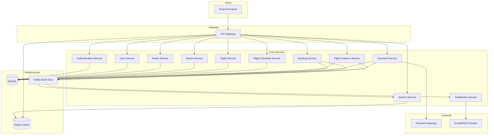
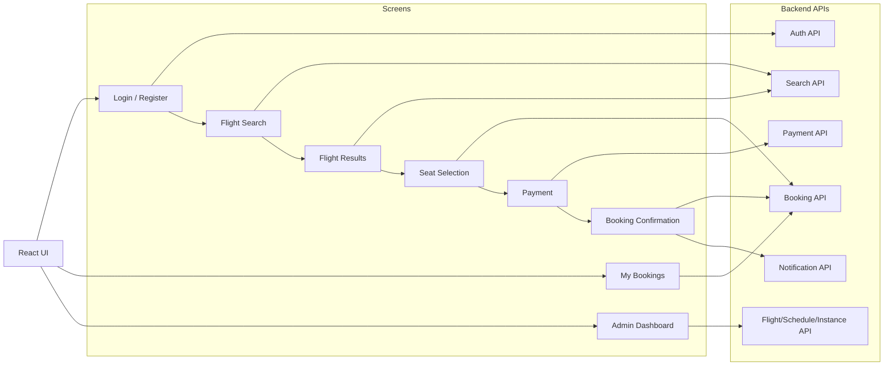
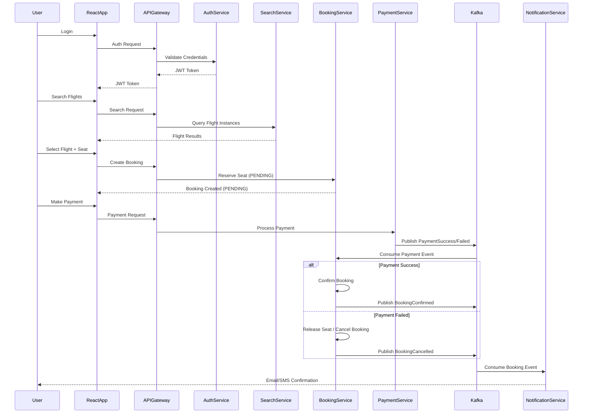
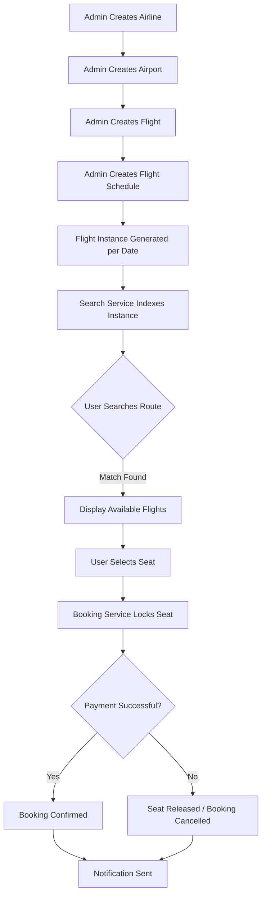
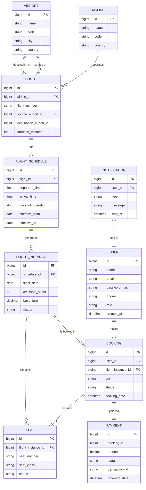
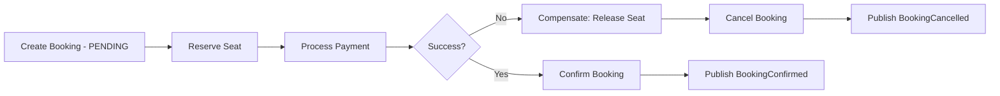

# ✈️ AirLink — Airline Reservation System

> A scalable Airline Global Distribution System (GDS) built using **Spring Boot Microservices**, **Apache Kafka**, **React**, **Docker**, and **Microsoft Azure**.


---

## Problem Statement

Booking a flight today still means dealing with **slow search results, inconsistent seat availability, and payment/booking failures** that leave a ticket "stuck" in limbo. Most monolithic airline systems struggle with:

- Scaling search and booking independently during peak traffic (festive seasons, sales)
- Keeping seat inventory consistent when thousands of users book concurrently
- Handling partial failures — payment succeeds but booking fails, or vice versa
- Slow rollout of new features because everything is deployed as one unit

**AirLink** solves this by breaking the airline reservation domain into independently deployable **microservices**, coordinated through **Kafka events** and the **Saga pattern**, so that search, booking, and payment can scale and fail independently without corrupting data consistency.

---

## Primary Persona

### Aisha — Frequent Flyer

| Field | Detail |
|---|---|
| Name | Aisha Sharma |
| Age | 31 |
| Occupation | Product Manager, travels for work |
| Location | Bengaluru |
| Booking frequency | 2–3 flights per month |

### Pain Points

- Wants to search multiple routes/dates quickly and compare fares
- Needs real-time seat availability — hates "seat no longer available" errors after payment
- Wants instant confirmation and email/SMS updates
- Occasionally needs to modify or cancel a booking

---

## Persona-Based Scenario

### Scenario — Booking a Flight During a Sale

#### Situation
- Aisha searches "Bengaluru → Delhi" for next Friday during a flash sale
- Thousands of users search and book the same flight instance concurrently

#### AirLink's Response
1. **Search Service** queries cached flight instances (Redis) for fast results
2. Aisha selects a flight and seat; **Booking Service** creates a `PENDING` booking and locks the seat
3. **Payment Service** processes payment via the payment gateway
4. On success, a `PaymentSuccess` event is published to **Kafka**
5. **Booking Service** consumes the event, confirms the booking (Saga orchestration)
6. **Notification Service** sends an email/SMS confirmation with the PNR

**Result:** Aisha gets a confirmed seat with no double-booking, even under heavy concurrent load. If payment fails or times out, the seat lock is released automatically via a compensating transaction.

---

## Application Workflow

### Registration & Authentication
- User registers with name, email, phone, and password
- **Authentication Service** issues a **JWT** on login
- All subsequent requests pass through the **API Gateway**, which validates the token before routing to downstream services

### Flight Search
- User searches by source, destination, and date
- **Search Service** queries indexed/cached flight instance data for low-latency results
- Results include airline, timings, duration, fare, and available seats

### Seat Selection & Booking
- User selects a flight instance and seat
- **Booking Service** creates a booking in `PENDING` state and temporarily reserves the seat
- Seat reservation uses optimistic locking / Redis-based short-lived locks to prevent double booking

### Payment
- **Payment Service** processes the transaction
- On success/failure, an event is published to Kafka
- **Booking Service** listens for this event to confirm or cancel the booking (Saga pattern ensures consistency across Booking + Payment)

### Notification
- **Notification Service** listens for `BookingConfirmed` / `BookingFailed` events
- Sends email notifications with PNR and itinerary details

### Admin Operations
- Admins manage Airlines, Airports, Flights, Flight Schedules, and Flight Instances via dedicated CRUD services
- Changes propagate to the Search Service's cache/index via Kafka events

---

## System Architecture

### High-Level Architecture



### Frontend → Backend Interaction



---

## Booking Sequence Flow (Saga Pattern)



---

## Flight & Booking Data Flow



---

## Entity Relationship (ER) Diagram



---

## Microservices

| Service | Responsibility |
|---|---|
| API Gateway | Single entry point; routing, JWT validation, rate limiting |
| Authentication Service | User login, JWT issuance & validation |
| User Service | User profile management |
| Airline Service | Airline CRUD operations |
| Airport Service | Airport CRUD operations |
| Flight Service | Flight master data |
| Flight Schedule Service | Recurring schedules for flights |
| Flight Instance Service | Daily/dated flight instances with seat inventory |
| Booking Service | Booking creation, confirmation, cancellation (Saga orchestrator) |
| Payment Service | Payment processing and transaction records |
| Search Service | Fast, cached flight search |
| Notification Service | Email/SMS notifications on booking events |

---

## Tech Stack

### Backend
- Java 21
- Spring Boot, Spring Security, Spring Cloud, Spring Data JPA
- Hibernate
- JWT Authentication
- REST APIs

### Frontend
- React
- Tailwind CSS
- Axios

### Database & Cache
- MySQL
- Redis

### Messaging
- Apache Kafka (event-driven communication, Saga pattern)

### DevOps
- Docker, Docker Compose
- GitHub Actions (CI/CD)
- Microsoft Azure

---

## Distributed Transaction Handling — Saga Pattern

Booking a flight touches **two services** (Booking + Payment) that must stay consistent without a shared database transaction.



Each step publishes an event; failures trigger **compensating actions** (like releasing a reserved seat) instead of a distributed lock/transaction across services.

---

## Project Structure

```
AirLink
│
├── Microservices
│   ├── api-gateway
│   ├── auth-service
│   ├── user-service
│   ├── airline-service
│   ├── airport-service
│   ├── flight-service
│   ├── flight-schedule-service
│   ├── flight-instance-service
│   ├── booking-service
│   ├── payment-service
│   ├── notification-service
│   └── search-service
│
├── airLink-frontend
│
├── docker-compose.yml
└── README.md
```

---

## Installation

### Clone Repository

```bash
git clone https://github.com/satyam6203/AirLink.git
cd AirLink
```

### Run using Docker

```bash
docker-compose up --build
```

### Run Individual Services

```bash
mvn spring-boot:run
```

---

## Environment Variables

```
MYSQL_USERNAME=root
MYSQL_PASSWORD=password

JWT_SECRET=your-secret-key

KAFKA_BOOTSTRAP_SERVERS=localhost:9092

REDIS_HOST=localhost
REDIS_PORT=6379
```

---

## API Documentation

Swagger UI (per service):

```
http://localhost:8080/swagger-ui/index.html
```

---

## Security

- JWT Authentication
- Spring Security
- Password Encryption (BCrypt)
- API Gateway–level authentication
- Role-Based Authorization (User / Admin)

---

## Scalability Features

- Stateless microservices — horizontally scalable
- Independent deployment per service
- Redis caching for hot search queries
- Event-driven architecture via Kafka
- API Gateway routing and load distribution
- Distributed transaction handling via Saga pattern

---

## Deployment

Containerized using **Docker** and deployed on **Microsoft Azure**, with CI/CD automated via **GitHub Actions**.

Live demo: [airlink-air.vercel.app](https://airlink-air.vercel.app/)

---

## Future Enhancements

- Kubernetes deployment
- OpenTelemetry distributed tracing
- ELK Stack centralized logging
- Prometheus + Grafana monitoring
- Rate limiting at the gateway
- Multi-region deployment
- Dynamic fare pricing engine

---

## Author

**Satyam Kumar Singh**

- GitHub: [@satyam6203](https://github.com/satyam6203)
- LinkedIn: [Satyam Kumar Singh](https://www.linkedin.com/in/satyam-kumar-singh-401047358/)

---

## Support

If you found this project useful, please consider giving it a ⭐ **Star** on GitHub.

---

## License

This project is licensed under the MIT License.
